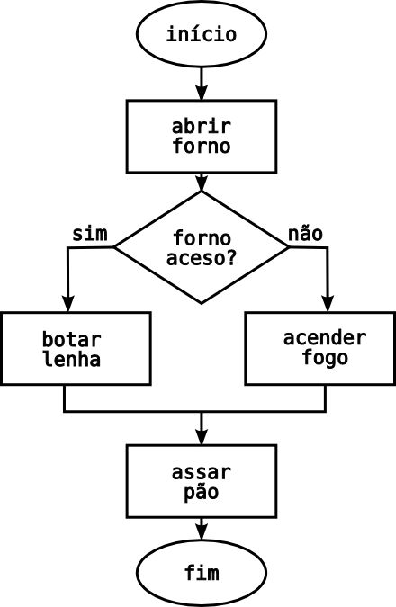

Uma sequência lógica de instruções que devem ser seguidas para a resolução de um problema ou para a execução de uma tarefa, usamos algoritmos mesmo sem saber em qualquer atividade do dia a dia, desde  as atividades mais triviais a mais complexa, temos sempre que seguir passos  lógicos para desenvolver nossas atividades, esses passos podemos chamar de  algoritmos não computacional ou algoritmos narrativos.

